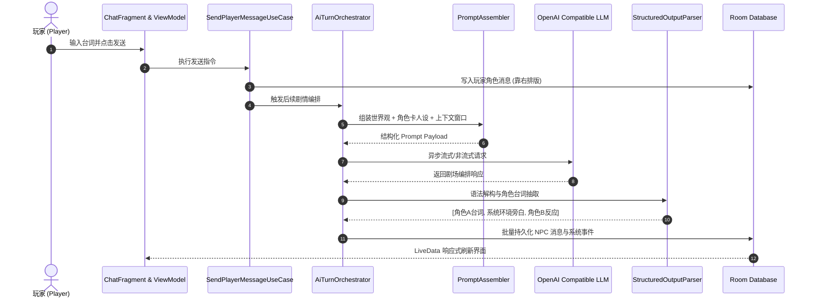

<div align="center">

# 🎭 满座 FullHouse

**好戏开场，群里已满座。**

*An Ensemble AI Roleplaying & Multi-Character Group Orchestration Android App.*

<p align="center">
  
  
  
  
  
  
</p>

<p align="center">
  <a href="#-这是什么">产品概念</a> •
  <a href="#-核心特性矩阵">特性矩阵</a> •
  <a href="#-效果演示">效果演示</a> •
  <a href="#-系统架构">系统架构</a> •
  <a href="#-快速开始">快速开始</a> •
  <a href="#-技术栈">技术栈</a> •
  <a href="#-路线图">路线图</a>
</p>

</div>

---

## 📖 目录

- [🎭 这是什么](#-这是什么)
- [✨ 核心特性矩阵](#-核心特性矩阵)
- [🖼️ 视觉与交互演示](#️-视觉与交互演示)
- [📐 架构设计与技术实现](#-架构设计与技术实现)
  - [Clean Architecture 分层模型](#clean-architecture-分层模型)
  - [AI 多角色发言编排流程](#ai-多角色发言编排流程)
- [🚀 快速开始](#-快速开始)
  - [环境准备](#环境准备)
  - [源码编译](#源码编译)
  - [API 配置说明](#api-配置说明)
- [🃏 角色卡与世界观兼容规范](#-角色卡与世界观兼容规范)
- [🛠️ 技术栈与依赖清单](#️-技术栈与依赖清单)
- [🗺️ 路线图 (Roadmap)](#️-路线图-roadmap)
- [🤝 参与贡献](#-参与贡献)
- [📄 开源协议](#-开源协议)

---

## 🎭 这是什么

传统的大模型角色扮演通常局限于**一对一私聊**，难以还原真实剧场、跑团跑桌或社交群聊中多角色交锋的张力。

**满座 FullHouse** 是一款**本地优先（Local-First）**的多人 AI 角色扮演群聊 Android 应用：

> 在一个类微信群聊的精致界面里，坐满了由大语言模型扮演的活生生角色。他们拥有各自的独立人设、立绘头像、专属语言风格与隐秘动机。他们会互相抢白、互生龃龉、结盟调侃、接住你的每一句台词。而你，既是同台竞技的演员，也是整场大戏的编导。

适用于：**TRPG 跑团爱好者、网文小说创作者、同人脑洞写手、赛博聊天陪伴需求者**。

```
┌─────────────────────────────────────────────────────────────┐
│ 🏛️ 世界观体系：赛博朝廷 / 废土客栈 / 夺嫡风云 / 克苏鲁调查      │
├─────────────────────────────────────────────────────────────┤
│ 🎭 群内 NPC 成员：冷面侍卫、傲娇军师、疯批刺客、深宫权臣...   │
├─────────────────────────────────────────────────────────────┤
│ 🎬 演播室机制：                                             │
│    • 玩家发言 ───► AI 编排仲裁 (谁接话/说几句/插入动作旁白)    │
│    • AI 一键推进 ─► 无需玩家下场，NPC 群体自主交锋推演数轮     │
│    • 身份穿梭 ────► 随时切换扮演主角、小厮或冷眼旁观的上帝    │
└─────────────────────────────────────────────────────────────┘
```

> 🔒 **隐私绝对防御**：项目遵循严格的本地优先原则。所有剧本、角色卡设定、聊天上下文、个性化装扮均 100% 留存在本地 SQLite (Room) 数据库中，**无中心服务器、无用户注册系统、无任何遥测跟踪**。仅在生成台词时，直连你自行配置的大模型 API。

---

## ✨ 核心特性矩阵

| 特性模块 | 核心亮点 | 说明与实现细节 |
| :--- | :--- | :--- |
| 💬 **群聊式戏剧演出** | 沉浸式仿即时通讯 UI | 玩家发言右侧停靠，AI 角色发言左侧停靠；环境描写、微表情、心理活动自动渲染为居中优雅系统消息。 |
| 🎬 **Agentic 智能编排** | `AiTurnOrchestrator` | 多角色不再机械轮询排队。AI 动态裁决当前最合适接话的角色、情绪起伏与话轮长度，支持一键「自动推演」，静观群友唇枪舌剑。 |
| 🌍 **世界观一键衍生** | 自动化背景构建 | 仅需输入「架空赛博中世纪」，AI 自动拆解并补齐时代、势力分布、世界底层法则、矛盾主线，并在对话中实现上下文无缝注入。 |
| 🃏 **全维度角色卡系统** | 结构化人设引擎 | 姓名、立绘、说话习惯、禁忌词、隐秘人设、人际网强弱关联。兼容 **TavernAI / SillyTavern** 格式 JSON 导入导出。 |
| 🎟️ **自由角色切换 (Morph)**| 随时分身演进 | 聊到一半可以从「名侦探」瞬移切换为「嫌疑人」甚至「纯旁白叙述者」，历史记录丝滑衔接。 |
| 🎨 **千人千面视觉定制** | 独立外观系统 | 每个 NPC 拥有专属的气泡背景、文字高亮配色；全局支持自由更换高清群聊壁纸与暗化遮罩。 |
| 📦 **模块化无损导入导出** | 剧本资产自由分享 | 角色卡、世界观设定、聊天记录均可独立导出，亦可一键打包成专属剧本包，便于创作者社区传播与二次创作。 |
| 🔐 **军工级密钥保护** | Android Keystore | API Key 经 Android Keystore 硬件安全芯片多层非对称/对称加密，杜绝明文写入 Preferences。多配置档案秒级热切换。 |


---

## 📐 架构设计与技术实现

本项目严格遵循 Android 官方推崇的 **Clean Architecture + MVVM + Repository** 分层架构模式，各模块保持高内聚低耦合。

### Clean Architecture 分层模型

```
┌─────────────────────────────────────────────────────────────┐
│                    Presentation Layer (UI)                  │
│       Fragments, ViewModels, ViewBinding, ItemAdapters      │
└──────────────────────────────┬──────────────────────────────┘
                               │ Observes LiveData / State
┌──────────────────────────────▼──────────────────────────────┐
│                      Domain Layer (业务核心)                 │
│   • UseCases (SendPlayerMessage, AdvanceAi, SwitchIdentity)  │
│   • AI Orchestration (AiTurnOrchestrator, PromptAssembler)  │
│   • Deduplicator, StructuredOutputParser, ContextPolicy     │
└──────────────────────────────┬──────────────────────────────┘
                               │ Repositories Interfaces
┌──────────────────────────────▼──────────────────────────────┐
│                       Data Layer (数据层)                    │
│   • Local: Room DB (AppDatabase, DAOs, Entity Migrations)   │
│   • Security: KeystoreSecretStore (KeyStore + Cipher)        │
│   • Remote: Retrofit2 + OkHttp3 (OpenAiCompatibleApi)       │
│   • Background: WorkManager (ExportWorker, OrphanCleanup)   │
└─────────────────────────────────────────────────────────────┘
```

### AI 多角色发言编排流程



---

## 🚀 快速开始

### 环境准备

- **操作系统**：Windows / macOS / Linux
- **开发工具**：Android Studio Ladybug / Koala 或更高版本
- **JDK 版本**：Java 17 或 Java 21（Gradle 8.13+ 兼容环境）
- **目标运行环境**：Android 8.0（API Level 26）及以上实体机或模拟器

### 源码编译

```bash
# 1. 克隆代码仓库
git clone https://github.com/jiang585/RolePlayAndroid.git

# 2. 进入项目主目录
cd RolePlayAndroid

# 3. 执行 Gradle 预编译检查
./gradlew check

# 4. 组装生成 Debug APK
./gradlew assembleDebug
```

编译输出路径：`app/build/outputs/apk/debug/app-debug.apk`。

### API 配置说明

本项目支持接入任何遵循 **OpenAI Chat Completions 规范** 的大模型服务商：

1. 启动 App 后，点击右上角齿轮进入 **「系统设置」→「API 配置档案」**。
2. 新建或编辑配置档案：
   - **Base URL**：例如 `https://api.openai.com/v1`、`https://api.deepseek.com/v1`、`https://api.siliconflow.cn/v1`
   - **API Key**：填写您申请的 API 秘钥（自动调用系统底层 Android KeyStore 加密存储）
   - **Model Name**：如 `deepseek-chat`、`gpt-4o`、`gemini-2.5-flash`、`claude-3-5-sonnet`
   - **Temperature / Top-P**：建议设定为 `0.85 ~ 1.0` 以获得生动饱满的角色语言张力。

---

## 🃏 角色卡与世界观兼容规范

满座 FullHouse 在底层实现了开放的数据导入导出交换标准：

- **TavernAI / SillyTavern 兼容**：原生支持导入 `character_book`、`personality`、`scenario`、`first_mes`、`mes_example` 字段。
- **混合文本自然语言导入**：只需直接将一段小说人物介绍粘贴至「AI 完善」窗口，内置的解析工作流即可自动结构化拆解出说话风格、口头禅、弱点特长与人际网络。

---

## 🛠️ 技术栈与依赖清单

| 依赖分类 | 核心库与版本 | 用途说明 |
| :--- | :--- | :--- |
| **核心架构** | Android Jetpack (Lifecycle, ViewModel, LiveData, Navigation) | 保证清晰的生命周期感知与界面导航流 |
| **持久化存储** | `androidx.room:room-runtime:2.6.1` + SQLite | 离线优先的核心关系型数据库，内嵌完备数据迁移方案 |
| **异步后台任务**| `androidx.work:work-runtime:2.9.0` | 负责剧本包批量导出压缩与孤立图像资源垃圾回收 |
| **网络与通信** | `Square Retrofit 2.9.0` + `OkHttp 4.12.0` | 高性能 HTTP Client 与 JSON 序列化通信 |
| **图片加载缓存**| `Bumptech Glide 4.16.0` | 角色立绘头像的高速圆角裁剪、内存与磁盘双重缓存 |
| **安全存储体系**| `androidx.security:security-crypto:1.1.0-alpha06` | Android Keystore 硬件根信任硬件加密支持 |
| **自动化测试** | `JUnit4` + `Mockito` + `Robolectric` | 全面的 ViewModel、Orchestrator 与 DAO 单元覆盖 |

---

## 🗺️ 路线图 (Roadmap)

- [x] **v1.0 (MVP 基线)**：完整的剧本生命周期、世界观编辑器、多角色卡管理、类微信即时群聊演播室、`AiTurnOrchestrator` 编排中枢、Tavern 角色卡导入导出、Keystore 安全密匙库。
- [ ] **v1.1 (剧情分支与回溯)**：支持对话分支树回退、重抽单条发言、分支剧情另存为新剧本。
- [ ] **v1.2 (二创分享市场)**：全离线 `.fullhouse` 单文件剧本包互传，扫码/局域网面对面快传。
- [ ] **v1.3 (端侧轻量小模型推理)**：引入 ONNX Runtime / MediaPipe LLM，实现断网离线状态下的超轻量本地角色微调对话。
- [ ] **v2.0 (多模态画廊与语音)**：角色定制立绘本地生成与语音合成（TTS）连麦广播。

---

## 🤝 参与贡献

我们极其重视开源社区的力量！欢迎提交 Issue 汇报缺陷，或发起 Pull Request 贡献代码：

1. **Fork** 本仓库并创建特性分支 (`git checkout -b feature/AmazingFeature`)。
2. 提交前请运行 `./gradlew test` 确保所有单元测试绿灯通过。
3. 遵循统一的代码格式与 Java 编程规范。
4. 提交清晰规范的 Commit Message (`git commit -m 'feat: add tavern card v2 parser support'`)。
5. 推送分支并开启 Pull Request。

---

## 📄 开源协议

本项目基于 **[MIT License](LICENSE)** 协议开源。无论个人研究、二次开发或学术引用，均享有极高自由度。

<div align="center">
  <sub>Built with ❤️ by FullHouse Contributors. 好戏开场，群里已满座。</sub>
</div>
