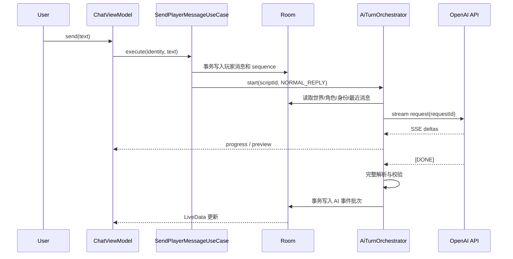

# RolePlayChat 架构与详细设计

> 文档版本：v1.0-draft  
> 需求基线：`需求文档.md` v1.0  
> 目标平台：Android 8.0（API 26）及以上  
> 设计范围：架构、模块、数据、接口、文件、流程、标准和测试设计，不包含代码实现

---

## 1. 文档目标

本文将需求转化为可实施、可测试、可追踪的技术设计，重点回答：

1. 系统如何分层，各层依赖方向是什么。
2. 每个功能由哪些 Java、XML、资源和测试文件承担。
3. Room 表、领域模型、AI 协议和导入导出格式如何定义。
4. 玩家身份切换、角色停用、流式生成、取消和异常恢复如何处理。
5. 编码前需要遵守哪些命名、数据、安全和测试标准。

## 2. 基线检查与前置决策

### 2.1 需求基线与当前工程差异

| 项目 | 需求基线 | 当前脚手架 | 实施前处理 |
| --- | --- | --- | --- |
| 语言 | Java | Kotlin | 业务代码按 Java 设计；移除 Kotlin 依赖需单独实施 |
| UI | Jetpack View + XML + Material Components | Jetpack Compose | 改为 AppCompat/Fragment/XML；本文不修改工程 |
| 最低版本 | API 26 | API 28 | 调整为 API 26 |
| 架构 | MVVM + LiveData + Repository + Manual DI | 无业务架构 | 按本文建立 |
| 包名 | 未正式确定 | `com.example.roleplaychat` | 发布前改为正式反向域名，本文暂沿用占位包名 |

上述差异是实施前置任务，不代表需要同时维护 Compose/Kotlin 与 View/Java 两套 UI。

### 2.2 本设计冻结的业务规则

1. 一个剧本同一时刻只有一个玩家身份，身份切换仅影响后续消息。
2. 玩家消息保存发送时的角色、昵称、头像和外观快照，历史显示不随角色修改而变化。
3. 玩家绑定某角色后，该角色在绑定期间排除出 AI 可编排 NPC 列表，避免同一角色同时由人和 AI 发言。
4. “删除角色”在剧本内解释为停用/离群，历史消息保留；删除剧本才硬删除全部关联记录。
5. 日期分隔由 UI 根据消息时间动态生成，不写入数据库；角色消息、旁白和系统事件写入数据库。
6. 世界观与剧本是一对一关系，仅由 `WorldSetting.scriptId` 维护，不在 `Script` 重复保存 `worldId`。
7. v1.0 不做 AI 头像生成，只支持内置头像、系统文件/相册选择和可选拍照。
8. 数据严格按剧本隔离，不做跨剧本长期记忆。
9. 隐藏设定可进入 AI 上下文，但默认不出现在普通预览、聊天导出和角色卡导出中。
10. 流式传输与结构化结果解析分离；未闭合的 JSON 不直接转换为正式消息。

### 2.3 MVP 限制建议

| 项目 | 默认值 | 可配置性 |
| --- | --- | --- |
| 单剧本启用角色数 | 20 | 固定产品限制 |
| 单条用户消息 | 4096 Unicode 字符 | 固定产品限制 |
| 单次 AI 批次事件数 | 8 | 固定安全上限 |
| AI 自动推进轮数 | 默认 3，范围 1~20 | 用户每次选择 |
| 导入单文件大小 | 20 MB | 固定安全上限 |
| 图片解码像素 | 最长边 4096 px | 导入时缩放 |
| 最近消息上下文 | 默认 40 条 | 设置可调整策略，不直接暴露精确 token |

## 3. 架构总览

### 3.1 架构风格

采用单 Android 应用模块、分层 MVVM、Repository、Manual DI。MVP 不拆 Gradle 多模块，避免为当前规模引入构建和依赖管理成本；包级边界保持清晰，为后续拆模块留出空间。

```text
┌─────────────────────────────────────────────────────┐
│ UI: Activity / Fragment / Adapter / ViewModel       │
│ XML View、LiveData、单向 UI State、用户事件          │
└───────────────────────┬─────────────────────────────┘
                        │ 调用用例/仓库接口
┌───────────────────────▼─────────────────────────────┐
│ Domain: Model / UseCase / AI Orchestrator / Policy  │
│ 业务规则、身份、编排、上下文、校验，不依赖 Android UI │
└───────────────────────┬─────────────────────────────┘
                        │ 接口
┌───────────────────────▼─────────────────────────────┐
│ Data: Room / Retrofit / OkHttp SSE / File / Crypto  │
│ Entity、DAO、DTO、Mapper、Repository 实现             │
└──────────────┬──────────────────────┬───────────────┘
               │                      │
       SQLite + 私有文件        OpenAI-compatible API
```

### 3.2 依赖规则

- UI 不直接调用 DAO、Retrofit、OkHttp、Keystore 或文件 API。
- ViewModel 不持有 Activity、Fragment、View 或长期 Context 引用。
- Domain 不依赖 Fragment、Room Entity、网络 DTO 和 Android View 类型。
- Data 负责领域模型与持久化/传输模型映射。
- `AppContainer` 是对象装配根；Fragment 通过统一 `ViewModelFactory` 获取依赖。
- 所有 Room、网络、图片和文件操作在后台线程执行，UI 只观察状态。

### 3.3 主要组件职责

| 组件 | 职责 | 不承担 |
| --- | --- | --- |
| Fragment | 渲染、收集输入、导航、生命周期绑定 | 业务规则、SQL、网络协议 |
| ViewModel | UI 状态、动作编排、调用 UseCase | 直接操作 View/DAO/OkHttp |
| UseCase/Orchestrator | 跨仓库业务流程与规则 | Android 页面行为 |
| Repository | 聚合本地、远程和文件数据源 | 具体 UI 展示 |
| DAO | 原子数据库读写 | 跨数据源业务流程 |
| SSE Client/Parser | HTTP 流读取与事件边界解析 | 决定角色或消息业务含义 |
| Import/Export Mapper | 格式版本、字段映射、校验 | 直接展示导入页面 |

## 4. 目录与文件级设计

> 下列是目标文件清单。简单 DTO/枚举可按实现情况合并，但不得破坏职责边界。

```text
RolePlayChat/
├─ build.gradle.kts                         # 根插件声明
├─ settings.gradle.kts                      # :app 模块和仓库
├─ gradle/libs.versions.toml                # 依赖版本目录
├─ 需求文档.md
├─ 架构与详细设计.md
└─ app/
   ├─ build.gradle.kts                      # Java/View/Room/Retrofit 等配置
   ├─ proguard-rules.pro                    # DTO、Room、Retrofit 保留规则
   └─ src/
      ├─ main/
      │  ├─ AndroidManifest.xml
      │  ├─ java/com/example/roleplaychat/
      │  │  ├─ RolePlayChatApp.java         # Application 与 AppContainer 初始化
      │  │  ├─ MainActivity.java            # 单 Activity 导航宿主
      │  │  ├─ di/
      │  │  │  ├─ AppContainer.java         # Manual DI 装配和应用级单例
      │  │  │  └─ ViewModelFactory.java     # ViewModel 构造分发
      │  │  ├─ data/
      │  │  │  ├─ local/
      │  │  │  │  ├─ AppDatabase.java
      │  │  │  │  ├─ DatabaseMigrations.java
      │  │  │  │  ├─ converter/RoomConverters.java
      │  │  │  │  ├─ entity/
      │  │  │  │  │  ├─ ScriptEntity.java
      │  │  │  │  │  ├─ WorldSettingEntity.java
      │  │  │  │  │  ├─ CharacterEntity.java
      │  │  │  │  │  ├─ SessionMemberEntity.java
      │  │  │  │  │  ├─ MessageEntity.java
      │  │  │  │  │  ├─ AppearanceEntity.java
      │  │  │  │  │  └─ ImportLogEntity.java
      │  │  │  │  └─ dao/
      │  │  │  │     ├─ ScriptDao.java
      │  │  │  │     ├─ WorldSettingDao.java
      │  │  │  │     ├─ CharacterDao.java
      │  │  │  │     ├─ SessionMemberDao.java
      │  │  │  │     ├─ MessageDao.java
      │  │  │  │     ├─ AppearanceDao.java
      │  │  │  │     └─ ImportLogDao.java
      │  │  │  ├─ remote/
      │  │  │  │  ├─ OpenAiCompatibleApi.java
      │  │  │  │  ├─ OpenAiServiceFactory.java
      │  │  │  │  ├─ dto/ChatCompletionRequestDto.java
      │  │  │  │  ├─ dto/ChatCompletionResponseDto.java
      │  │  │  │  ├─ dto/ChatCompletionChunkDto.java
      │  │  │  │  ├─ sse/SseClient.java
      │  │  │  │  ├─ sse/SseEventParser.java
      │  │  │  │  └─ interceptor/AuthInterceptor.java
      │  │  │  ├─ file/
      │  │  │  │  ├─ LocalAssetStore.java
      │  │  │  │  ├─ ImageImporter.java
      │  │  │  │  ├─ ImportReader.java
      │  │  │  │  ├─ ExportWriter.java
      │  │  │  │  └─ ScriptPackageArchive.java
      │  │  │  ├─ security/
      │  │  │  │  ├─ SecretStore.java
      │  │  │  │  └─ KeystoreSecretStore.java
      │  │  │  ├─ mapper/
      │  │  │  │  ├─ EntityMapper.java
      │  │  │  │  ├─ CharacterCardMapper.java
      │  │  │  │  └─ TavernCharacterMapper.java
      │  │  │  └─ repository/
      │  │  │     ├─ ScriptRepositoryImpl.java
      │  │  │     ├─ WorldRepositoryImpl.java
      │  │  │     ├─ CharacterRepositoryImpl.java
      │  │  │     ├─ ChatRepositoryImpl.java
      │  │  │     ├─ AppearanceRepositoryImpl.java
      │  │  │     ├─ SettingsRepositoryImpl.java
      │  │  │     ├─ AiRepositoryImpl.java
      │  │  │     └─ ImportExportRepositoryImpl.java
      │  │  ├─ domain/
      │  │  │  ├─ model/
      │  │  │  │  ├─ Script.java
      │  │  │  │  ├─ WorldSetting.java
      │  │  │  │  ├─ CharacterProfile.java
      │  │  │  │  ├─ PlayerIdentity.java
      │  │  │  │  ├─ ChatMessage.java
      │  │  │  │  ├─ Appearance.java
      │  │  │  │  ├─ AiBatch.java
      │  │  │  │  └─ AppError.java
      │  │  │  ├─ repository/
      │  │  │  │  ├─ ScriptRepository.java
      │  │  │  │  ├─ WorldRepository.java
      │  │  │  │  ├─ CharacterRepository.java
      │  │  │  │  ├─ ChatRepository.java
      │  │  │  │  ├─ AppearanceRepository.java
      │  │  │  │  ├─ SettingsRepository.java
      │  │  │  │  ├─ AiRepository.java
      │  │  │  │  └─ ImportExportRepository.java
      │  │  │  ├─ usecase/
      │  │  │  │  ├─ CreateScriptUseCase.java
      │  │  │  │  ├─ DeleteScriptUseCase.java
      │  │  │  │  ├─ SaveCharacterUseCase.java
      │  │  │  │  ├─ SwitchIdentityUseCase.java
      │  │  │  │  ├─ SendPlayerMessageUseCase.java
      │  │  │  │  ├─ AdvanceAiUseCase.java
      │  │  │  │  ├─ StopGenerationUseCase.java
      │  │  │  │  ├─ ImportDataUseCase.java
      │  │  │  │  └─ ExportDataUseCase.java
      │  │  │  ├─ ai/
      │  │  │  │  ├─ PromptAssembler.java
      │  │  │  │  ├─ ContextWindowPolicy.java
      │  │  │  │  ├─ AiTurnOrchestrator.java
      │  │  │  │  ├─ StructuredOutputParser.java
      │  │  │  │  └─ AiOutputValidator.java
      │  │  │  └─ validation/
      │  │  │     ├─ ScriptValidator.java
      │  │  │     ├─ CharacterValidator.java
      │  │  │     ├─ ApiConfigValidator.java
      │  │  │     └─ ImportValidator.java
      │  │  ├─ ui/
      │  │  │  ├─ common/
      │  │  │  │  ├─ UiState.java
      │  │  │  │  ├─ SingleEvent.java
      │  │  │  │  ├─ ErrorMessageMapper.java
      │  │  │  │  ├─ FilePickerHelper.java
      │  │  │  │  └─ PermissionHelper.java
      │  │  │  ├─ script/
      │  │  │  │  ├─ ScriptListFragment.java
      │  │  │  │  ├─ ScriptListViewModel.java
      │  │  │  │  ├─ ScriptListAdapter.java
      │  │  │  │  ├─ ScriptEditFragment.java
      │  │  │  │  ├─ ScriptEditViewModel.java
      │  │  │  │  └─ ScriptDetailFragment.java
      │  │  │  ├─ world/WorldEditFragment.java
      │  │  │  ├─ world/WorldEditViewModel.java
      │  │  │  ├─ character/
      │  │  │  │  ├─ CharacterListFragment.java
      │  │  │  │  ├─ CharacterListAdapter.java
      │  │  │  │  ├─ CharacterEditFragment.java
      │  │  │  │  ├─ CharacterEditViewModel.java
      │  │  │  │  ├─ CharacterImportFragment.java
      │  │  │  │  └─ CharacterImportViewModel.java
      │  │  │  ├─ identity/IdentityChooserFragment.java
      │  │  │  ├─ identity/IdentityViewModel.java
      │  │  │  ├─ chat/
      │  │  │  │  ├─ ChatFragment.java
      │  │  │  │  ├─ ChatViewModel.java
      │  │  │  │  ├─ ChatMessageAdapter.java
      │  │  │  │  ├─ ChatUiState.java
      │  │  │  │  └─ ChatAction.java
      │  │  │  ├─ appearance/AppearanceFragment.java
      │  │  │  ├─ appearance/AppearanceViewModel.java
      │  │  │  ├─ settings/SettingsFragment.java
      │  │  │  └─ settings/SettingsViewModel.java
      │  │  ├─ worker/
      │  │  │  ├─ ExportWorker.java
      │  │  │  └─ OrphanAssetCleanupWorker.java
      │  │  └─ util/
      │  │     ├─ AppExecutors.java
      │  │     ├─ Clock.java
      │  │     ├─ IdGenerator.java
      │  │     ├─ JsonUtils.java
      │  │     └─ FileNameSanitizer.java
      │  └─ res/
      │     ├─ layout/
      │     │  ├─ activity_main.xml
      │     │  ├─ fragment_script_list.xml
      │     │  ├─ item_script.xml
      │     │  ├─ fragment_script_edit.xml
      │     │  ├─ fragment_script_detail.xml
      │     │  ├─ fragment_world_edit.xml
      │     │  ├─ fragment_character_list.xml
      │     │  ├─ item_character.xml
      │     │  ├─ fragment_character_edit.xml
      │     │  ├─ fragment_character_import.xml
      │     │  ├─ fragment_identity_chooser.xml
      │     │  ├─ fragment_chat.xml
      │     │  ├─ item_message_mine.xml
      │     │  ├─ item_message_theirs.xml
      │     │  ├─ item_message_narration.xml
      │     │  ├─ item_message_event.xml
      │     │  ├─ item_date_separator.xml
      │     │  ├─ dialog_ai_advance.xml
      │     │  ├─ fragment_appearance.xml
      │     │  └─ fragment_settings.xml
      │     ├─ navigation/nav_graph.xml
      │     ├─ menu/menu_chat.xml
      │     ├─ values/{strings,colors,dimens,styles,themes}.xml
      │     ├─ values-night/{colors,themes}.xml
      │     └─ xml/{file_paths,backup_rules,data_extraction_rules}.xml
      ├─ test/java/com/example/roleplaychat/
      │  ├─ domain/ai/{PromptAssembler,StructuredOutputParser}Test.java
      │  ├─ domain/usecase/{SwitchIdentity,AdvanceAi}UseCaseTest.java
      │  ├─ data/mapper/CharacterCardMapperTest.java
      │  └─ ui/chat/ChatViewModelTest.java
      └─ androidTest/java/com/example/roleplaychat/
         ├─ data/local/AppDatabaseTest.java
         ├─ data/file/ImportExportTest.java
         └─ ui/CoreJourneyTest.java
```

### 4.1 资源文件约定

- 所有用户可见文本放入 `strings.xml`，Java/XML 禁止硬编码。
- 尺寸放入 `dimens.xml`，颜色使用语义名，如 `chat_bubble_mine`，不使用 `blue_500` 表达业务含义。
- 用户图片复制到应用私有目录，数据库仅保存资源 ID 或相对路径。
- 通过 Storage Access Framework 选取文件，分享使用 `FileProvider`，不请求宽泛存储权限。

## 5. 领域模型设计

### 5.1 聚合与关系

```text
Script 1 ─── 1 WorldSetting
Script 1 ─── N CharacterProfile
Script 1 ─── N SessionMember
Script 1 ─── N ChatMessage
Script 1 ─── 1 SCRIPT Appearance
CharacterProfile 1 ─── 0..1 CHARACTER Appearance Override
```

`Script` 是数据隔离和删除边界。AI 请求、消息分页、导入导出和装扮读取均必须带 `scriptId`。

### 5.2 主要领域模型 Java 示例

以下代码仅用于定义模型形状和标准，不是实现代码。

```java
public final class PlayerIdentity {
    public enum RoleType { PROTAGONIST, SUPPORTING, OBSERVER }

    private final String scriptId;
    private final RoleType roleType;
    private final String characterId; // OBSERVER 时为 null
    private final long changedAt;
}
```

```java
public final class ChatMessage {
    public enum Type { CHARACTER_TEXT, NARRATION, SYSTEM_EVENT }
    public enum Side { MINE, THEIRS, CENTER }
    public enum Status { STREAMING, DONE, CANCELLED, FAILED }

    private final String id;
    private final String scriptId;
    private final String characterId;       // 可空
    private final String senderDisplayName; // 历史快照
    private final String senderAvatarRef;   // 历史快照
    private final Type type;
    private final Side side;
    private final String content;
    private final long sequence;
    private final long createdAt;
    private final Status status;
    private final String requestId;         // AI 消息可空
    private final String batchId;           // AI 批次可空
    private final Integer turnIndex;         // AI 批次内顺序可空
}
```

```java
public final class CharacterProfile {
    private final String id;
    private final String scriptId;
    private final String name;
    private final List<String> aliases;
    private final String personality;
    private final String backstory;
    private final String speakingStyle;
    private final List<String> catchphrases;
    private final Map<String, String> relationships;
    private final String hiddenSetting;
    private final boolean enabled;
}
```

### 5.3 枚举持久化标准

- 数据库和 JSON 保存稳定英文代码，不保存 Java ordinal。
- 未知代码读取为 `UNKNOWN` 或产生可恢复校验错误，不因新增枚举导致崩溃。
- 展示文案通过资源映射，不直接展示枚举代码。

## 6. Room 数据库详细设计

### 6.1 通用规则

- 数据库名：`role_play_chat.db`，初始版本 `1`。
- 主键使用 UUID 字符串，便于导入导出和跨包引用。
- 时间统一存 Unix epoch milliseconds，导出时转 ISO 8601 UTC。
- 复杂数组和 Map 以 JSON TEXT 存储并由 `RoomConverters` 转换。
- 禁止 `fallbackToDestructiveMigration`；每次 schema 变化必须提供迁移和测试。
- 启用外键；跨表写入由 `runInTransaction` 保证一致性。

### 6.2 表定义

#### `scripts`

| 字段 | 类型/约束 | 说明 |
| --- | --- | --- |
| `id` | TEXT PK | UUID |
| `name` | TEXT NOT NULL | 1~80 字符 |
| `one_line` | TEXT | 一句话简介，最大 500 字符 |
| `cover_ref` | TEXT | 内置资源 ID 或私有文件相对路径 |
| `created_at` | INTEGER NOT NULL | 创建时间 |
| `updated_at` | INTEGER NOT NULL | 最近内容/聊天变更时间 |
| `sort_index` | INTEGER NOT NULL DEFAULT 0 | 手工排序预留 |

索引：`updated_at DESC`、`sort_index`。删除时级联数据库子记录，之后异步清理文件。

#### `world_settings`

| 字段 | 类型/约束 | 说明 |
| --- | --- | --- |
| `id` | TEXT PK | UUID |
| `script_id` | TEXT NOT NULL UNIQUE FK | `scripts.id ON DELETE CASCADE` |
| `era` | TEXT | 时代 |
| `location` | TEXT | 地点 |
| `factions_json` | TEXT NOT NULL DEFAULT `[]` | 势力数组 |
| `rules_json` | TEXT NOT NULL DEFAULT `[]` | 规则数组 |
| `story_hook` | TEXT | 主线线索 |
| `background_full` | TEXT | 完整背景 |
| `tags_json` | TEXT NOT NULL DEFAULT `[]` | 标签 |
| `version_note` | TEXT | 备注，不等于版本回退 |
| `updated_at` | INTEGER NOT NULL | 修改时间 |

#### `characters`

| 字段组 | 关键字段 |
| --- | --- |
| 身份 | `id` PK、`script_id` FK CASCADE、`name` NOT NULL、`aliases_json` |
| 基础资料 | `avatar_ref`、`gender`、`age_text` |
| 角色设定 | `personality`、`backstory`、`speaking_style`、`system_prompt`、`hidden_setting` |
| 列表数据 | `catchphrases_json`、`strengths_json`、`flaws_json`、`relationships_json`、`sample_lines_json` |
| 状态 | `sort_index`、`enabled`、`created_at`、`updated_at` |
| 兼容 | `extra_json`，保留第三方未知字段 |

索引：`(script_id, sort_index)`、`(script_id, enabled)`、`(script_id, name)`。允许同名角色，以 ID 区分。

#### `session_members`

| 字段 | 类型/约束 | 说明 |
| --- | --- | --- |
| `id` | TEXT PK | UUID |
| `script_id` | TEXT NOT NULL FK CASCADE | 所属剧本 |
| `character_id` | TEXT FK RESTRICT，可空 | 旁观者为空 |
| `member_type` | TEXT NOT NULL | `NPC` / `PLAYER` |
| `player_role_type` | TEXT | `PROTAGONIST` / `SUPPORTING` / `OBSERVER` |
| `active` | INTEGER NOT NULL | 当前是否在群内 |
| `joined_at` | INTEGER NOT NULL | 加入时间 |

业务唯一约束：每个剧本最多一个 active PLAYER；`(script_id, character_id)` 不重复。该规则在事务和 DAO 查询中共同保证。

#### `messages`

| 字段 | 类型/约束 | 说明 |
| --- | --- | --- |
| `id` | TEXT PK | UUID |
| `script_id` | TEXT NOT NULL FK CASCADE | 聚合边界 |
| `character_id` | TEXT FK SET NULL，可空 | 仅用于关联，历史依赖快照展示 |
| `sender_name_snapshot` | TEXT | 发送时昵称 |
| `sender_avatar_snapshot` | TEXT | 发送时头像引用 |
| `appearance_snapshot_json` | TEXT | 气泡关键外观快照 |
| `player_role_type` | TEXT | 玩家消息身份快照 |
| `type` | TEXT NOT NULL | `CHARACTER_TEXT` 等 |
| `side` | TEXT NOT NULL | `MINE` / `THEIRS` / `CENTER` |
| `content` | TEXT NOT NULL | 允许流式初始空串 |
| `sequence` | INTEGER NOT NULL | 剧本内单调递增 |
| `created_at` | INTEGER NOT NULL | 时间 |
| `status` | TEXT NOT NULL | 生成状态 |
| `request_id` | TEXT | AI 请求 ID |
| `batch_id` | TEXT | AI 批次 ID |
| `turn_index` | INTEGER | 批次内顺序 |
| `error_code` | TEXT | 失败分类，不存敏感原文 |
| `meta_json` | TEXT | 可选扩展 |

唯一索引：`(script_id, sequence)`。查询索引：`(script_id, sequence DESC)`、`(script_id, status)`、`request_id`、`batch_id`。

`sequence` 在 Room 事务中取当前最大值加一；批量插入连续分配，避免按时间排序产生抖动。

#### `appearances`

| 字段 | 说明 |
| --- | --- |
| `id` PK | UUID |
| `scope_type` | `GLOBAL` / `SCRIPT` / `CHARACTER` |
| `scope_id` | GLOBAL 为固定值，其他为实体 ID |
| `background_type` / `background_ref` | `BUILTIN` / `IMAGE` 与资源引用 |
| `background_mode` | `FIT_CENTER` / `CENTER_CROP` / `TILE` |
| `background_dim_alpha` | 0.0~1.0 |
| `bubble_style_id` | 内置样式 ID |
| `bubble_color` / `text_color` / `nickname_color` | `#AARRGGBB` |
| `font_scale` | 0.85~1.30 |

唯一索引：`(scope_type, scope_id)`。解析优先级：角色覆盖 > 剧本设置 > 全局设置 > 应用默认。

#### `import_logs`

记录导入类型、格式版本、来源显示名、时间、结果和非敏感错误码。不得保存 API Key、完整隐藏设定或外部绝对路径。

### 6.3 删除和恢复语义

| 操作 | 数据库行为 | 文件行为 |
| --- | --- | --- |
| 停用角色 | `enabled=false`、成员 inactive | 不删除头像 |
| 清空聊天 | 删除该 `script_id` 的消息 | 不删除角色/背景 |
| 删除剧本 | 事务级联删除子表 | 事务成功后 CleanupWorker 清理无引用资源 |
| 取消生成 | 部分消息保留，状态改 `CANCELLED` | 无 |
| 启动恢复 | 将遗留 `STREAMING` 改 `FAILED/PROCESS_INTERRUPTED` | 无 |

## 7. Repository 与用例接口

### 7.1 接口示例

```java
public interface ChatRepository {
    LiveData<List<ChatMessage>> observeLatest(String scriptId, int limit);
    List<ChatMessage> loadBefore(String scriptId, long beforeSequence, int limit);
    ChatMessage insertPlayerMessage(PlayerIdentity identity, String content);
    void insertAiBatch(String scriptId, AiBatch batch);
    void updateStreamingContent(String messageId, String content);
    void markRequestCancelled(String requestId);
    void clearMessages(String scriptId);
}
```

```java
public interface AiRepository {
    CancellableRequest streamChat(
        AiRequest request,
        AiStreamListener listener
    );
}
```

回调事件必须映射为领域事件，如 `Started`、`TextDelta`、`Completed`、`Failed`，UI 不感知 Retrofit/OkHttp 类型。

### 7.2 核心用例

| 用例 | 输入 | 关键规则 | 输出 |
| --- | --- | --- | --- |
| `CreateScriptUseCase` | 名称、一句话 | 同事务创建 Script、World、Script Appearance、Player slot | scriptId |
| `SwitchIdentityUseCase` | scriptId、roleType、characterId | 校验角色启用；切换后排除对应 NPC | PlayerIdentity |
| `SendPlayerMessageUseCase` | identity、文本 | 长度校验、快照入库、触发一次 AI 编排 | requestId |
| `AdvanceAiUseCase` | scriptId、轮数 | 1~20；逐轮请求；每轮检查停止标记 | batch progress |
| `StopGenerationUseCase` | requestId | `Call.cancel()`；落库取消状态 | result |
| `ImportDataUseCase` | URI、类型、模式 | 预检、预览确认、事务写入、资源本地化 | import result |
| `DeleteScriptUseCase` | scriptId | DB 成功后再清理孤儿文件 | completion |

## 8. AI 对话与编排详细设计

### 8.1 请求上下文组成

按固定顺序组装，避免不同入口产生不一致 Prompt：

1. 产品协议：仅输出允许的结构化事件，不泄露系统提示。
2. 世界观摘要：时代、地点、规则、势力、主线。
3. 启用 NPC 摘要：稳定角色 ID、姓名、性格、说话方式、关系和目标。
4. 玩家当前身份：绑定角色完整必要信息；旁观者则声明玩家输入为导演/叙述指令。
5. 隐藏设定：仅加入相关角色的 AI 上下文。
6. 旧对话摘要（存在时）。
7. 最近消息，按 token 预算由旧到新裁剪但始终保留最后一条玩家输入。
8. 回合指令：普通回复或自动推进、最大事件数、语言和长度。

### 8.2 上下文预算

```text
可用输入预算 = 模型上下文上限
             - 最大输出 token
             - 安全余量（建议 10%）
```

裁剪顺序：低相关旧消息 -> 旧摘要细节 -> 次要角色样例台词；世界规则、当前身份和最新消息不可裁剪。无法可靠取得模型窗口时使用保守默认值。

### 8.3 标准结构化输出

```json
{
  "schema_version": 1,
  "request_id": "9f29a39e-01b2-4f37-9187-61b113c72859",
  "events": [
    {
      "event_id": "0a8f95cf-12e1-45a1-876a-dfe93474cd42",
      "type": "narration",
      "content": "（林晚晴把茶杯轻轻推到桌边。）"
    },
    {
      "event_id": "735124be-9288-467b-b42e-7c80b836d53f",
      "type": "character_turn",
      "character_id": "char-uuid-002",
      "content": "先喝口茶，我们慢慢说。"
    }
  ]
}
```

### 8.4 JSON Schema 核心约束

- `schema_version` 当前只接受 `1`。
- `request_id` 必须与客户端请求一致。
- `events` 数量 1~8，保持最终渲染顺序。
- `type` 仅允许 `narration`、`character_turn`、`system_event`。
- `character_turn.character_id` 必须属于本次提供的启用 NPC ID 集合。
- `content` 去除首尾空白后必须非空，单事件不超过 4096 字符。
- 未知字段忽略并记录诊断；未知类型或未知角色事件丢弃并产生可见的非敏感提示。

### 8.5 流式策略

结构化 JSON 在结束前通常不合法，因此分为两层：

```text
OkHttp byte stream
  -> SseEventParser（处理 data、多行、[DONE]、跨包）
  -> raw delta buffer（仅累积模型内容）
  -> 可选受控预览文本
  -> [DONE]
  -> StructuredOutputParser（完整 JSON）
  -> AiOutputValidator
  -> Message 批次事务入库
  -> UI 按 sequence 渲染
```

MVP 推荐：UI 可显示“正在生成”和安全的文本增量预览，正式角色归属与多消息拆分在完整结果校验后提交。若供应商支持可靠的 tool call delta，再按 tool 参数边界增量展示，但仍以最终校验结果为准。

### 8.6 玩家发送时序



### 8.7 AI 自动推进

- 每轮是独立请求并有独立 `requestId`，整个推进任务共享 `batchId`。
- 第 N 轮完成入库后才能开始 N+1，确保上下文包含上一轮。
- 停止标记在每轮开始前和 SSE 回调中检查。
- 用户发送新消息时，默认先取消正在自动推进的任务，防止消息顺序竞争。
- 达到轮数、用户停止、API 失败、空事件或内容策略错误时结束。

### 8.8 错误分类与降级

| 错误码 | 场景 | UI 行为 | 可重试 |
| --- | --- | --- | --- |
| `NETWORK_UNAVAILABLE` | 无网络/超时 | 显示重试 | 是 |
| `AUTH_INVALID` | 401/403 | 引导 API 设置 | 配置后 |
| `RATE_LIMITED` | 429 | 显示稍后重试 | 是 |
| `MODEL_NOT_FOUND` | 模型不存在 | 引导模型设置 | 配置后 |
| `OUTPUT_INVALID` | JSON/Schema 不合法 | 显示可读纯文本或失败提示 | 是 |
| `UNKNOWN_CHARACTER` | AI 返回未知 ID | 丢弃该事件，保留合法事件 | 部分成功 |
| `CANCELLED_BY_USER` | 主动停止 | 保留已完成内容 | 否 |
| `PROCESS_INTERRUPTED` | 进程重启 | 标记失败并提供重试 | 是 |

纯文本降级不得展示 system prompt、请求头、tool 参数或内部诊断内容。

## 9. 导入导出设计与标准

### 9.1 通用信封

所有自定义 JSON 使用 UTF-8、snake_case 和统一信封：

```json
{
  "format": "roleplay-character-card",
  "schema_version": 1,
  "exported_at": "2026-08-16T08:00:00Z",
  "generator": "RolePlayChat/1.0",
  "data": {}
}
```

文件命名建议：

- 角色卡：`character_<safe-name>_<yyyyMMdd-HHmmss>.json`
- 世界观：`world_<safe-name>_<yyyyMMdd-HHmmss>.json`
- 聊天：`chat_<safe-name>_<yyyyMMdd-HHmmss>.json` 或 `.txt`
- 剧本包：`script_<safe-name>_<yyyyMMdd-HHmmss>.rpczip`

### 9.2 自定义角色卡标准示例

```json
{
  "format": "roleplay-character-card",
  "schema_version": 1,
  "exported_at": "2026-08-16T08:00:00Z",
  "generator": "RolePlayChat/1.0",
  "data": {
    "external_id": "2daff562-a9e7-4bd1-a61d-aea109716803",
    "name": "林晚晴",
    "aliases": ["晚晚"],
    "gender": "女",
    "age": "21",
    "personality": "温和克制，在原则问题上坚定。",
    "backstory": "生长于旧书铺，自幼熟悉地方掌故。",
    "speaking_style": "句式简洁，偶尔引用旧诗。",
    "catchphrases": ["先别急。"],
    "strengths": ["观察力强"],
    "flaws": ["害怕突发改变"],
    "relationships": [
      {"target_name": "张三", "relation": "青梅竹马"}
    ],
    "sample_lines": ["先喝口茶，我们慢慢说。"],
    "system_prompt": "保持角色知识边界，不替玩家做决定。",
    "avatar": {
      "mode": "embedded",
      "media_type": "image/webp",
      "data_base64": "..."
    },
    "appearance": {
      "bubble_style_id": "rounded_tail_v1",
      "bubble_color": "#FFF4E6",
      "text_color": "#FF202124",
      "nickname_color": "#FF7A3E00"
    },
    "extensions": {}
  }
}
```

默认导出不含 `hidden_setting`。用户显式选择时写入并在导出确认页警示其敏感性。

### 9.3 TavernAI 类格式映射

| 外部字段 | 内部字段 | 规则 |
| --- | --- | --- |
| `name` | `name` | 必填 |
| `description` | `backstory` | 无 backstory 时使用 |
| `personality` | `personality` | 直接映射 |
| `first_mes` / `char_greeting` | `sample_lines[0]` | 优先 `first_mes` |
| `mes_example` | `sample_lines` | 按明确分隔符解析，否则保存单条 |
| `scenario` | `backstory` 扩展 | 不自动覆盖剧本世界观 |
| `system_prompt` | `system_prompt` | 导入预览中明确展示 |
| `avatar` | 本地 `avatar_ref` | 校验后复制到私有目录 |
| 未知字段 | `extra_json` | 原样保留以便再导出 |

“兼容 TavernAI”必须按测试样本声明支持版本；不能笼统承诺所有变体。PNG 元数据角色卡可作为后续适配器，不纳入首个 P0 JSON 实现。

### 9.4 聊天导出标准

JSON 中保存：消息 ID、顺序、时间、类型、发送者快照、正文和状态。默认排除失败空消息、内部 `meta_json`、request body、system prompt 和 API 配置。TXT 使用明确的 UTF-8 可读格式：

```text
[2026-08-16 16:30] 我 / 林晚晴：先去看看门外。
[2026-08-16 16:30] 旁白：（走廊尽头传来一声轻响。）
[2026-08-16 16:31] 张三：我和你一起去。
```

### 9.5 剧本包结构

```text
manifest.json
script.json
world.json
characters/<character-id>.json
messages/messages.json
assets/<sha256>.<ext>
```

`manifest.json` 保存 format、schema version、文件清单、大小和 SHA-256。导入时先验证 manifest，再解压到临时私有目录，确认后事务入库并移动资源。

### 9.6 导入模式

- `CREATE_NEW`：新建实体并建立 external ID -> local ID 映射。
- `MERGE`：保留现有数据，对 ID/名称冲突逐项预览确认。
- `REPLACE`：仅聊天记录支持，二次确认后在事务中替换指定范围。
- 导入必须经历：读取 -> 类型识别 -> 安全校验 -> 字段映射 -> 预览 -> 用户确认 -> 事务写入 -> 资源提交。

### 9.7 文件安全

- 所有输入视为不可信，校验 MIME、文件签名、大小、JSON 深度和图片像素。
- Zip 解压规范化路径必须位于临时目标目录内，拒绝绝对路径和 `..`，防止 Zip Slip。
- 远程头像仅允许 HTTPS，默认需用户确认，限制重定向、超时和响应大小。
- 文件名经过 `FileNameSanitizer`；数据库不存外部绝对路径。
- 分享 URI 仅通过 `FileProvider` 临时授权只读权限。

## 10. UI 与状态设计

### 10.1 页面导航

```text
S1 ScriptList
 ├─ S2 ScriptEdit
 ├─ S3 ScriptDetail
 │   ├─ S4 WorldEdit
 │   ├─ S5 CharacterList -> CharacterEdit
 │   ├─ S6 CharacterImport
 │   ├─ S7 IdentityChooser
 │   ├─ S8 Chat
 │   └─ S9 Appearance
 └─ S10 Settings
```

所有导航参数只传稳定 ID，不传完整 Parcelable 大对象。页面重建后通过 ID 从 Repository 恢复。

### 10.2 ViewModel 状态标准

```java
public final class ChatUiState {
    private final boolean initialLoading;
    private final boolean loadingEarlier;
    private final boolean generating;
    private final String activeRequestId;
    private final List<ChatListItem> items;
    private final PlayerIdentity identity;
    private final String draft;
    private final AppError error;
}
```

- 持久展示内容放 `UiState`；Toast、导航、文件选择等一次性行为用 `SingleEvent`。
- 旋转屏幕不得重复发送消息或重新触发 AI 请求。
- 保存输入草稿和 AI 推进轮数；进程重建后由 `SavedStateHandle` 恢复页面 ID 与草稿。

### 10.3 聊天列表

- RecyclerView 使用稳定消息 ID 和多 ViewType。
- Room 每页建议 50 条，按 sequence 倒序读取后在 UI 正序展示。
- 新消息到达时：用户接近底部则自动滚动；用户正在阅读历史则显示“新消息”提示，不强制跳转。
- 日期分隔根据相邻消息本地日期动态插入 `ChatListItem.DateSeparator`。
- 流式 UI 更新节流到约 50~100 ms 一次，避免每 token 全量刷新列表。
- 背景图只作用于消息区；暗化层与文字对比度必须保证可读性。

### 10.4 权限和系统能力

- 相册/文件优先使用系统 Photo Picker 或 SAF，无需长期存储权限。
- 拍照仅在启用该入口时申请 Camera，并使用 FileProvider 临时 URI。
- Android 13+ 使用系统新选择器；API 26+ 提供 SAF 回退。
- 网络权限在 Manifest 声明；生产环境默认拒绝明文 HTTP，可通过 Network Security Config 明确控制开发例外。

## 11. 设置与安全设计

### 11.1 设置分类

| 类型 | 保存位置 | 示例 |
| --- | --- | --- |
| 敏感 | Keystore-backed `SecretStore` | API Key |
| 普通偏好 | SharedPreferences（或后续 DataStore） | BaseURL、模型、temperature、top_p、token 参数 |
| 业务数据 | Room | 剧本、角色、消息、装扮 |
| 二进制资源 | 应用私有文件目录 | 头像、背景、导出临时文件 |

不建议使用通用 `Setting(key,value)` Room 表存 API Key，以免误导出、误备份或日志泄露。

### 11.2 API 配置校验

- BaseURL 必须是合法 HTTPS URL；开发构建可显式允许局域网 HTTP。
- API Key 输入只显示掩码，不在错误文案中回显。
- temperature 建议 0.0~2.0，top_p 0.0~1.0，max_tokens 1~供应商允许上限。
- 提供“测试连接”，使用最小请求并对认证、模型和网络错误分类。
- OkHttp 日志不得记录 `Authorization`、完整 Prompt、聊天正文和响应正文。

### 11.3 备份策略

- API Key 和临时导出目录明确排除自动备份和设备迁移。
- 本地聊天是否参与系统备份属于隐私产品决策；MVP 建议默认排除，用户通过显式导出备份。
- 导出文件由用户主动创建和分享，设置页面解释其可能包含隐私内容。

## 12. 并发、事务与生命周期

### 12.1 执行器

- `diskIO`：Room 事务、JSON、压缩和文件复制。
- `networkIO`：Retrofit/OkHttp 请求。
- `mainThread`：LiveData 和 View 更新。
- Manual DI 注入 `AppExecutors`，测试中替换为同步执行器。

### 12.2 并发规则

- 每个剧本最多一个 active AI generation；不同剧本可以各自生成。
- 生成状态以 `scriptId -> GenerationSession` 在应用级协调器维护。
- 消息 sequence 分配和插入必须同一事务。
- 导入资源先写临时目录；DB 事务成功后原子移动，失败则清理临时文件。
- 删除剧本和生成请求冲突时，先取消生成，再删除；迟到回调按 script 是否存在丢弃。

### 12.3 幂等

- 客户端生成唯一 `requestId` 和 `eventId`。
- `(requestId, eventId)` 应在消息元数据或独立约束中防重复提交。
- 网络重试创建新 requestId，但在 UI 关联原失败请求；不覆盖历史部分消息。

## 13. 质量属性设计

### 13.1 性能

- Room 索引支持按剧本分页；不一次加载全部历史。
- Glide 对头像和背景做尺寸采样与磁盘缓存。
- JSON/Zip/图片处理放后台线程并限制资源大小。
- RecyclerView 使用 DiffUtil，只更新流式消息项。
- 数据库查询和 AI Prompt 只取需要字段，避免装载大图/base64。

### 13.2 离线

- 剧本、角色、世界、聊天浏览、装扮和本地导入导出均可离线。
- AI 完善和对话入口在无网络时保留但显示可操作错误。
- 不自动丢弃用户发送的消息；AI 失败可在该消息后重试。

### 13.3 可维护性

- Repository 接口放 Domain，实现放 Data。
- 每项数据库变更同时更新 Entity、Migration、Schema 导出和迁移测试。
- 外部角色卡格式通过 Mapper/Adapter 扩展，不把兼容分支塞入 UI。
- 错误使用稳定代码，UI 通过 `ErrorMessageMapper` 映射本地化文案。

## 14. 编码与数据标准

### 14.1 Java 标准

- Java 11；类名 PascalCase，方法/字段 camelCase，常量 UPPER_SNAKE_CASE。
- 一个 public 顶级类一个文件；包名全小写。
- 公开 Repository/UseCase 方法参数进行 null 与范围校验。
- Domain 模型尽量不可变；集合构造时防御性复制并只读暴露。
- 禁止在业务代码使用 `System.currentTimeMillis()` 和随机 UUID 静态调用，统一注入 `Clock`、`IdGenerator` 便于测试。
- 错误通过结果对象或明确异常层次传播，禁止空 catch。

### 14.2 数据标准

- JSON 字段统一 snake_case，Java 字段 camelCase，通过序列化注解映射。
- ID 为 UUID 字符串；颜色为 8 位 `#AARRGGBB`；时间导出为 ISO 8601 UTC。
- 文本入库保留用户换行，不存富文本 Span；显示层负责格式。
- 所有格式包含 `schema_version`，解析器拒绝未知主版本并给出升级提示。
- Room 枚举保存稳定字符串，不保存 ordinal。

### 14.3 Git/评审标准

- 数据模型、AI 协议、导入格式变更需要同步本文档或 ADR。
- P0 功能提交需包含对应测试，不接受只验证正常路径。
- 涉及 API Key、文件解析、Zip 和外部 URL 的变更必须进行安全评审。

## 15. 测试设计

### 15.1 测试金字塔

| 层级 | 重点 | 工具建议 |
| --- | --- | --- |
| 单元测试 | Validator、Mapper、Prompt、Parser、UseCase、ViewModel | JUnit4、Mockito |
| 数据集成 | Room 外键/分页/迁移/事务 | AndroidX Room Test |
| 网络契约 | SSE 分包、错误码、取消、非法 JSON | MockWebServer |
| 文件安全 | 格式版本、损坏图片、Zip Slip、回滚 | Instrumentation |
| UI 测试 | 核心用户旅程和旋转恢复 | Espresso |

### 15.2 关键测试场景

1. 身份切换后新消息使用新角色，旧消息快照不变。
2. 玩家绑定角色后 Prompt 的 NPC 列表排除该角色。
3. 停用角色后历史消息仍可渲染，AI 不再编排该角色。
4. 同毫秒多条消息仍按 sequence 稳定排序。
5. SSE 在任意字节处分包、多行 data、空事件和 `[DONE]` 均正确处理。
6. 非法 JSON、Markdown 包裹 JSON、未知角色和超长事件不会导致崩溃。
7. 自动推进停止后不再启动下一轮，已完成消息保留。
8. 进程重启后遗留 STREAMING 消息被标记为可重试失败。
9. 剧本删除级联清库，引用共享资源不被误删。
10. 导入发生字段/资源错误时数据库整体回滚。
11. Zip Slip、超大文件、损坏 base64 和非 HTTPS URL 被拒绝。
12. 导出再导入后消息顺序、角色映射和头像引用一致。

## 16. FR/AC 追踪矩阵

| 需求 | 主要模块/文件 | 数据/协议 | 验收 |
| --- | --- | --- | --- |
| FR-101~106 | `ui/script/*`、Script UseCase/Repository | scripts、world cascade | AC-01、AC-11 |
| FR-201~204 | `ui/world/*`、WorldRepository、PromptAssembler | world_settings | AC-01 |
| FR-301~307 | `ui/character/*`、CharacterRepository/Mapper | characters、session_members、角色卡 JSON | AC-02、AC-03 |
| FR-401~404 | `ui/identity/*`、SwitchIdentityUseCase | PlayerIdentity、消息快照 | AC-04 |
| FR-501~510 | `ui/chat/*`、ChatRepository、AiTurnOrchestrator | messages、SSE、AI event schema | AC-05~07、AC-11 |
| FR-601~606 | `ui/appearance/*`、AppearanceRepository | appearances、私有图片 | AC-08 |
| FR-701~708 | Import/Export UseCase、Mapper、file/* | 通用信封、rpczip、FileProvider | AC-03、AC-09 |
| FR-801~804 | `ui/settings/*`、SecretStore、SettingsRepository | Keystore、普通偏好 | AC-10、AC-11 |

### 16.1 补充验收细则

- AC-04：切换身份后历史消息头像、昵称、位置和气泡不变化。
- AC-05：AI 返回空数组、非法结构或未知角色时不崩溃，并保留合法事件或显示重试。
- AC-06：停止后 300 ms 内取消本地 Call，后续迟到回调不得落库。
- AC-07：取消和异常都必须有终态，数据库不得长期残留 STREAMING。
- AC-08：背景文件损坏/丢失时回退到内置背景。
- AC-09：往返导入导出保持角色关系、消息 sequence 和 schema version。
- AC-10：错误日志和 UI 不显示 API Key，认证错误可直接导航设置。
- AC-11：覆盖 API 26、API 33+ 文件选择、旋转、进程重建和深浅主题。

## 17. 实施顺序建议

1. **基础迁移**：将脚手架切到 Java + View/XML、API 26，建立导航、Application、DI 和基础主题。
2. **本地核心**：完成 Room schema、Repository、剧本/世界观/角色/身份管理及测试。
3. **聊天本地闭环**：消息分页、快照、气泡和装扮，不接 AI 也可发送与浏览。
4. **AI 基础设施**：设置加密、OpenAI 请求、SSE、结构化解析、取消和 MockWebServer 测试。
5. **AI 业务闭环**：普通回复、动作旁白、自动推进、错误恢复和上下文裁剪。
6. **导入导出**：自定义角色卡、Tavern JSON、世界观、聊天，再考虑剧本包。
7. **稳定性验收**：性能、权限、安全、API 26/新系统、深浅主题和全部 AC 回归。

## 18. 待产品确认项

下列事项不阻塞总体架构，但应在对应功能编码前确认：

1. 正式 applicationId/包名。
2. v1.0 是否开启拍照入口；若不开启可完全不申请 Camera 权限。
3. 隐藏设定是否在 v1.0 UI 中可见和可编辑。
4. 是否支持第三方 PNG 元数据角色卡，还是首版只支持 JSON。
5. 本地聊天是否允许 Android 系统自动备份；本文默认不允许。
6. 结构化输出失败时，是显示清洗后的原始文本，还是只显示失败并重试；本文建议可读文本优先。
7. BaseURL 是否允许用户配置 HTTP；本文建议 release 仅 HTTPS。
8. 世界观版本回退为 P2，若确认实施需新增 `world_setting_revisions` 表，不能只依赖 `version_note`。

---

本文是编码实施基线。需求、模型、AI 输出结构或文件格式发生破坏性变化时，应提升相应 schema version，并同步数据库迁移、解析器、测试和本设计文档。
